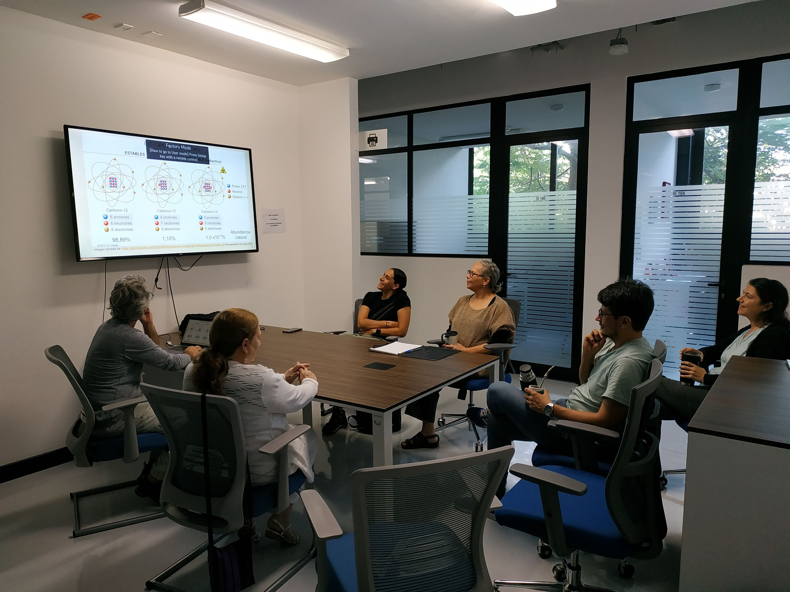

## ENES Mérida - Investigación
### Departamento de Matemáticas Aplicadas y Computación
> Repositorio de software, escritos en diversos lenguajes de programación, para usarlos como apoyo en las labores de investigación del Departamento de Matemáticas Aplicadas y Computación.

### [**[Regresar al repositorio principal]**](https://github.com/ENES-Merida)
